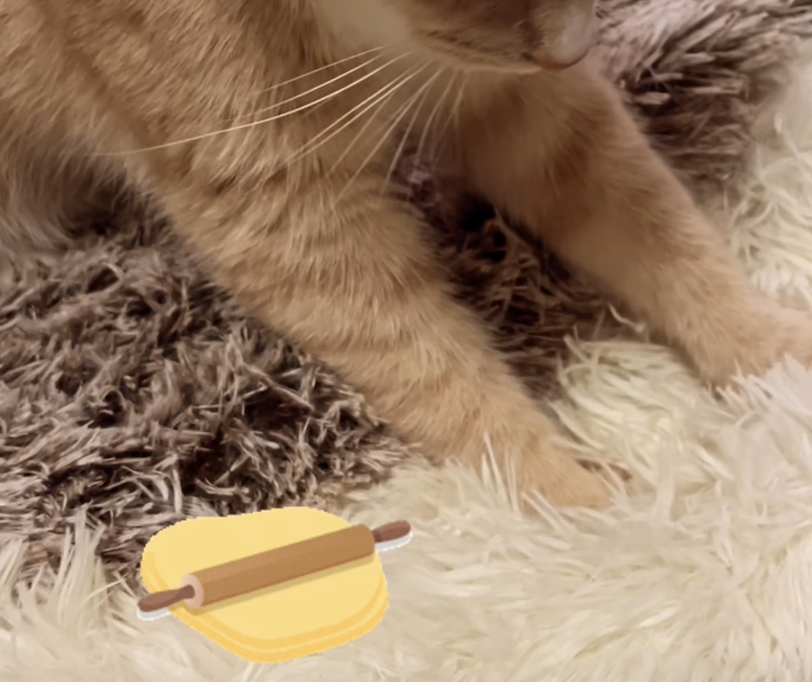

# Mocha

- Mocha was found outside **Starbuck** at the beiginning of 2023
- We adopted him from **[Animal Rescue League of Boston](https://www.arlboston.org/)**
- Shelter gave his name **lunchbox**.
- Hungry Mocha loves any kinds of protein 🐟🐔🐑🍣 no favorite, equally love 💗

## Refrigerator Hacker
:::danger Be Careful
This action is dangerous.
:::

> "In ancient times cats were worshipped as gods; they have not forgotten this." — Terry Pratchett

## Master of Dough Making
:::tip Buy soft flour

The Softer the cusion is, the louder noise you will hear from Master Mocha.

:::


## Meet Mocha, the Adventurous Cat
:::info
Mocha is not just any cat—he loves playing in my backpack, is a little shy at first, but always warms up and becomes friendly with other cats. Here’s a fun C# code sample that brings his character to life:
:::

- [x] Finish 4 meals
- [ ] Make a new friend
- [x] ~~Hack Kitchen~~
- [x] ~~Hack Balcony~~
- [ ] Ask for patting
- [x] Napping

```csharp
using System;
using System.Collections.Generic;

public class Cat
{
    public string Name { get; set; }
    public bool IsShy { get; set; }
    public List<string> FavoriteSpots { get; set; }
    public List<string> Friends { get; set; }

    public Cat(string name, bool isShy)
    {
        Name = name;
        IsShy = isShy;
        FavoriteSpots = new List<string>();
        Friends = new List<string>();
    }
}
```


Let's simulate Mocha's day!

```csharp

public class Program
{
    public static void Main()
    {
        // Create an instance for Mocha
        Cat mocha = new Cat("Mocha", true);
        
        // Add his favorite spots
        mocha.AddFavoriteSpot("Backpack");
        mocha.AddFavoriteSpot("Sunny Window Sill");

        // Add some friends he enjoys meeting
        mocha.AddFriend("Sophie");
        mocha.AddFriend("Mika");
        mocha.AddFriend("Luna");
        
        // Simulate Mocha's day
        mocha.Eat("breakfast");
        mocha.Play();
        mocha.Eat("lunch", 3);
        mocha.Greet();
        mocha.MeetFriends("Luna");
        mocha.Nap("Sunny Window Sill");
    }
}